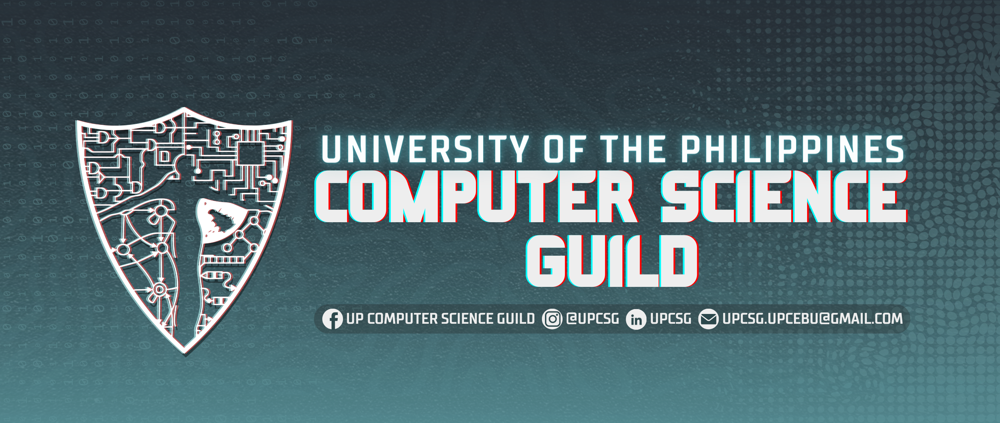

# UP Computer Science Guild Website

The official website of the UP Computer Science Guild, built with Next.js, TypeScript, and Tailwind CSS.

## Features

- 🎨 Modern and responsive design
- 🔐 Authentication system
- 📱 Mobile-first approach
- 🚀 Server-side rendering with Next.js
- 🎭 Beautiful animations with Framer Motion
- 📝 Dynamic content management
- 🔄 Real-time updates
- 🎯 SEO optimized

## Tech Stack

- **Framework:** Next.js 14
- **Language:** TypeScript
- **Styling:** Tailwind CSS
- **State Management:** Zustand
- **Animations:** Framer Motion
- **Icons:** React Icons
- **HTTP Client:** Axios
- **Authentication:** JWT
- **Deployment:** Docker & Nginx

## Getting Started

### Prerequisites

- Node.js 18 or later
- npm or yarn
- Docker (for containerized deployment)

### Installation

1. Clone the repository:
   ```bash
   git clone https://github.com/your-username/upcsg-website-v2.git
   cd upcsg-website-v2
   ```

2. Install dependencies:
   ```bash
   npm install
   ```

3. Create a `.env.local` file in the root directory:
   ```
   NEXT_PUBLIC_API_URL=your_api_url_here
   ```

4. Start the development server:
   ```bash
   npm run dev
   ```

The application will be available at `http://localhost:3000`.

## Project Structure

```
├── app/                 # Next.js app directory
├── components/         # React components
│   ├── admin/         # Admin panel components
│   ├── generics/      # Reusable components
│   ├── landing/       # Landing page components
│   └── ui/            # UI components
├── configs/           # Configuration files
├── docs/              # Documentation
├── hooks/             # Custom React hooks
├── interface/         # TypeScript interfaces
├── lib/               # Utility libraries
├── public/            # Static assets
├── store/             # State management
└── utils/             # Utility functions
```

## Development

### Available Scripts

- `npm run dev` - Start development server
- `npm run build` - Build for production
- `npm run start` - Start production server
- `npm run lint` - Run ESLint

### Code Style

The project uses ESLint and Prettier for code formatting. Run `npm run lint` to check for code style issues.

## Deployment

The project is configured for Docker deployment with Nginx as a reverse proxy. See the `docker-compose.yml` and `Dockerfile` for details.

### Docker Deployment

1. Build the Docker image:
   ```bash
   docker build -t upcsg-website .
   ```

2. Run with Docker Compose:
   ```bash
   docker-compose up -d
   ```

## API Integration

The website integrates with a backend API. See `API_SETUP.md` for detailed API configuration instructions.

## Contributing

1. Fork the repository
2. Create your feature branch (`git checkout -b feature/amazing-feature`)
3. Commit your changes (`git commit -m 'Add some amazing feature'`)
4. Push to the branch (`git push origin feature/amazing-feature`)
5. Open a Pull Request

## License

This project is licensed under the MIT License - see the LICENSE file for details.

## Contact

For any questions or concerns, please contact the UP Computer Science Guild.

## Acknowledgments

- UP Computer Science Guild
- All contributors and maintainers
